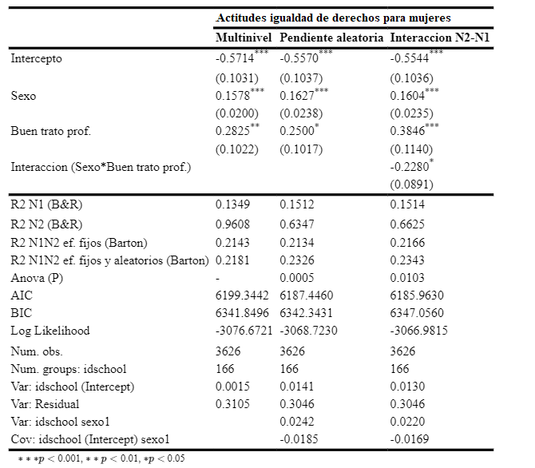
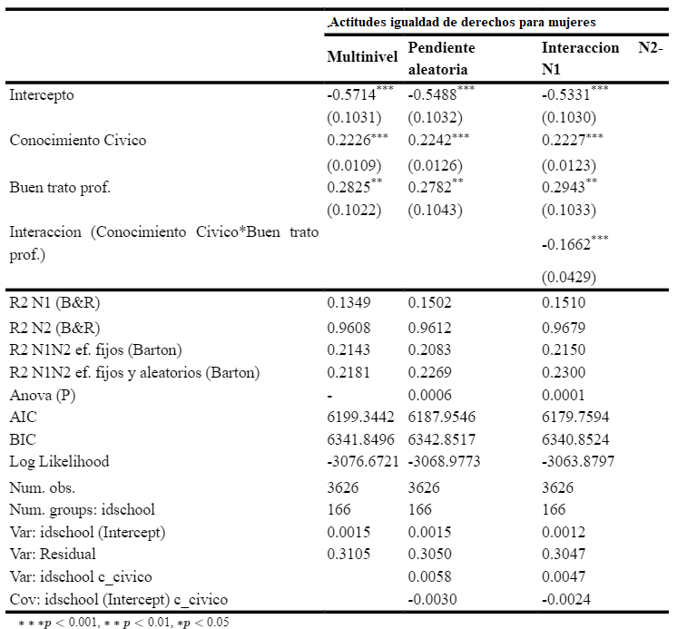

# Resultados

## Análisis descriptivo

```{r include=FALSE, results='asis'}

# Funciones para renderizar tablas tanto en HTML como en pdf
if (!require("pacman")) install.packages("pacman")  #si falta pacman, instalar
if (!require("tinytex")) install.packages("tinytex")#si falta tinytex, instalar
pacman::p_load(knitr, summarytools, kableExtra, dplyr, lavaan, haven, htmlwidgets, webshot, sjPlot,sjlabelled) # librerias

knitr::opts_chunk$set(warning = FALSE,  # mensaje de warning
                      message = FALSE,  # mensajes/avisos de librerias
                      cache = FALSE,    # cache de los chunks,usar analisis pesados
                      out.width = '85%',# largo de imagen en %
                      fig.pos= "H",     # posicion figuras H = HERE
                      echo = FALSE      # incluir chunk en output
)

# Otras configuraciones
options(scipen=999) # notacion cientifica
options(knitr.kable.NA = '') # NA en kable = ''

# Funciones para renderizar tablas tanto en HTML como en pdf
fwidth = if(is_html_output()) { #Usar en argumento "full_width" de kableExtra
  T
} else if(is_latex_output()) {
  F
}

graph.magnif_table = if(is_html_output()) { # Usar en argumento "graph.magnif=" de summarytools
  1.2
} else if(is_latex_output()) {
  0.75
}

width_table = if(is_html_output()) {
  800
} else if(is_latex_output()) { # Usar en "width=" dentro del argumento "image=" en kable
  500
}

# Css
st_css()
st_options(lang = "en",
           footnote = NA,
           bootstrap.css = F,
           custom.css = "input/css/dfsummary.css")

# Cargar base de datos procesada
load(file = "input/data/proc/data_proc.RData")


data_proc=data_proc0 %>%
  dplyr::select(
    f.genero,
    f.homosexual,
    f.etnico,
    "c_civico"=PV1CIV,
    "sexo"=S_GENDER,
    "migratorio"=IS3G04A,
    etnico,
    "educ_apod"=S_HISCED,
    "ocup_apod"=S_HISEI,
    "libros"=IS3G11,
    num_fem,
    num_etn,
    num_mig,
    f.ap_discusion_aula,
#f.ap_discusion,
    f.buen_clima_prof_aula,
#f.buen_clima_prof,
    f.buen_clima_est_aula,
#f.buen_clima_est,
    f.mal_clima_aula,
#f.mal_clima,
    idschool
  ) %>% as.data.frame()

data_proc <- na.omit(data_proc)


data_proc=set_label(data_proc,label=c("Actitudes hacia la igualdad de derechos entre hombres y mujeres (IDM)",
                                 "Actitudes hacia la igualdad de derechos para homosexuales (IDH)",
                                 "Actitudes hacia la igualdad de derechos para grupos étnicos (IDGE)",
                                 "Conocimiento civico",
                                 "Sexo",
                                 "Antecedentes migratorios",
                                 "Pertenencia a grupo étnico",
                                 "Nivel educacional de los padres",
                                 "Estatus ocupacional de los padres",
                                 "Cantidad de libros en el hogar",
                                 "Proporción de niñas",
                                 "Proporción de estudiantes pertenecientes a un grupo étnico",
                                 "Proporción de estudiantes con antecedentes migratorios",
                                 "Apertura a la discusión en el aula",
                                 #"Apertura a la discusión en el aula ind",
                                 "Relaciones interpersonales entre profesores y estudiantes",
                                 #"Relaciones interpersonales entre profesores y estudiantes ind",
                                 "Relaciones interpersonales entre estudiantes",
                                 #"Relaciones interpersonales entre estudiantes ind",
                                 "Situaciones de violencia física, emocional o verbal",
                                 #"Situaciones de violencia física, emocional o verbal ind",
                                 "Establecimiento educacional"
                        ))

data_proc %>% get_label

# Df variables nivel 1: dependientes
desc01_dep<- dfSummary(select(data_proc,f.genero,f.homosexual,f.etnico),
               plain.ascii = FALSE,
               style = "grid",
               tmp.img.dir = "/tmp",
               graph.magnif = TRUE,
               headings = F,  # encabezado
               varnumbers = F, # num variable
               labels.col = T, # etiquetas
               na.col = F,    # missing
               graph.col = T, # plot
               valid.col = T, # n valido
               #col.widths = c(1000,10,10,10)
               )

desc01_dep$Variable= NULL

view(desc01_dep,file = "desc01_dep.html") # Ver tabla en un archivo HTML
webshot(url ="desc01_dep.html" ,file ="input/images/desc01_dep.png",vheight = 10)


# Df variables nivel 1: estudiantes...........................................


desc01_indep_ind<- dfSummary(select(data_proc,c_civico,sexo,migratorio,etnico,educ_apod,ocup_apod,libros),
               plain.ascii = FALSE,
               style = "grid",
               tmp.img.dir = "/tmp",
               graph.magnif = TRUE,
               headings = F,  # encabezado
               varnumbers = F, # num variable
               labels.col = T, # etiquetas
               na.col = F,    # missing
               graph.col = T, # plot
               valid.col = T, # n valido
               #col.widths = c(1000,10,10,10)
               )

desc01_indep_ind$Variable= NULL


view(desc01_indep_ind,file = "desc01_indep_ind.html") # Ver tabla en un archivo HTML
webshot(url ="desc01_indep_ind.html" ,file ="input/images/desc01_indep_ind.png",vheight = 10)


# Independientes escuela

# Df variables nivel 1: dependientes
desc01_indep_col<- dfSummary(dplyr::select(data_proc,num_fem,num_etn,num_mig,f.ap_discusion_aula,f.buen_clima_prof_aula,f.buen_clima_est_aula,f.mal_clima_aula),
               plain.ascii = FALSE,
               style = "grid",
               tmp.img.dir = "/tmp",
               graph.magnif = TRUE,
               headings = F,  # encabezado
               varnumbers = F, # num variable
               labels.col = T, # etiquetas
               na.col = F,    # missing
               graph.col = T, # plot
               valid.col = T, # n valido
               #col.widths = c(1000,10,10,10)
               )


desc01_indep_col$Variable= NULL


view(desc01_indep_col,file = "desc01_indep_col.html") # Ver tabla en un archivo HTML
webshot(url ="desc01_indep_col.html" ,file ="input/images/desc01_indep_col.png",vheight = 10)


```

```{r, echo=FALSE, results='asis'}
knitr::kable(data.frame(image='{height=50%}'),    # generar tabla
             caption="Variables dependientes",
             col.names = "",
             row.names = F,
             format = "pandoc") %>%  kable_styling(latex_options = c("HOLD_position"),full_width = fwidth)
```

```{r, echo=FALSE, results='asis'}
knitr::kable(data.frame(image='{height=50%}'),    # generar tabla
             caption="Variables independientes nivel individual",
             col.names = "",
             row.names = F,
             format = "pandoc") %>%  kable_styling(latex_options = c("HOLD_position"),full_width = fwidth)
```

```{r, echo=FALSE, results='asis'}
knitr::kable(data.frame(image='{height=50%}'),    # generar tabla
             caption="Variables independientes nivel escuela",
             col.names = "",
             row.names = F,
             format = "pandoc") %>%  kable_styling(latex_options = c("HOLD_position"),full_width = fwidth)
```

## Análisis multinivel

En esta sección se analizan los efectos tanto de las características individuales como de las características y prácticas de la escuela en tres dimensiones de las actitudes hacia la igualdad de derechos. Los resultados de los modelos de regresión multinivel se presentan primero en una tabla y después en un gráfico con los coeficientes beta estandarizados. 

Antes de presentar los resultados de los modelos estimados, cabe precisar la correlación intraclase de cada variable dependiente. Este coeficiente representa el porcentaje de variación entre escuelas de la varianza de cada variable dependiente. Para la dimensión de actitudes hacia la igualdad de derechos entre hombres y mujeres la correlación intraclase corresponde a un 9.72% de la varianza de las actitudes de los estudiantes. Para la dimensión de actitudes hacia la igualdad de derechos para grupos étnicos la correlación intraclase es un 9.48% de la varianza de estas actitudes. Por último, para la dimensión de actitudes hacia la igualdad de derechos para homosexuales la correlación intraclase corresponde a un 7.57% de la varianza de estas actitudes.

En la siguiente tabla se presentan los resultados de los modelos de regresión donde se estiman los efectos directos de las variables independientes en las tres variables dependientes. En el listado de predictores (o variables independientes) se presentan primero las variables individuales que caracterizan a los estudiantes y después variables del contexto, como la caracterización del curso en términos de composición y la apertura a la discusión. 

```{r, echo=FALSE, results='asis'}
knitr::kable(data.frame(image='{height=90%}'),    # generar tabla
             caption="Modelo teórico",
             col.names = "",
             row.names = F,
             format = "pandoc") %>%  kable_styling(latex_options = c("HOLD_position"),full_width = fwidth)
```


Respecto a las características individuales, se evidencia que pertenecer al sexo femenino y que el nivel conocimiento cívico del estudiante se asocian positiva, significativa y consistentemente con las tres dimensiones analizadas de las actitudes hacia la igualdad de derechos. El efecto del sexo es especialmente fuerte en lo que refiere a las actitudes hacia la igualdad de derechos para homosexuales, mientras que el efecto del conocimiento cívico es particularmente bajo en dicha dimensión. Los efectos de estas variables en las otras dos dimensiones son muy similares entre sí. Por su parte, el análisis diferenciado de los efectos de los tres tipos de recursos socioeconómicos permite precisar que el nivel educacional de los padres y la cantidad de libros en el hogar tienen un efecto significativo en las actitudes hacia la igualdad de derechos entre hombres y mujeres, y para los grupos étnicos, pero prácticamente no influyen en las actitudes hacia la igualdad de derechos para los homosexuales. Contrariamente a lo hipotetizado, la ocupación de los padres, el origen étnico y los antecedentes migratorios no poseen efectos significativos. Los modelos explican el 13.49%, el 7.1% y el 10% de la varianza entre individuos respectivamente, siguiendo el cálculo de R2 B&R. 

Respecto a las características de la escuela, los resultados indican que sólo las buenas relaciones entre estudiantes y profesores fomentan una actitud más favorable a la igualdad de derechos entre hombres y mujeres y para grupos étnicos, aunque no las fomenta en lo que refiere a los homosexuales. La apertura a la discusión en el aula posee un efecto positivo sobre la actitud hacia la igualdad de derechos para mujeres, pero no se ha encontrado evidencia que respalde esta relación en lo que refiere a las actitudes hacia la igualdad de derechos para grupos étnicos y homosexuales. Por último, la composición del curso en términos de género, pertenencia a grupos étnicos y antecedentes migratorios parece no afectar las actitudes de los estudiantes. Los modelos son ampliamente capaces de explicar las diferencias entre escuelas, los dos primeros explican más del 96% de la varianza a nivel dos, mientras que el tercero explica un cuarto. Sin embargo, cabe precisar que estos resultados se deben analizar con cautela, ya que es probable que estos efectos estén sobredimensionados por la cantidad de variables predictoras a nivel 2 en contraste con la poca varianza en este nivel.

El siguiente gráfico nos muestra los efectos estandarizados, lo que nos permite comparar la magnitud del efecto de las distintas variables. Podemos apreciar que las variables que tienen un impacto más relevante son individuales, más específicamente, la pertenencia al sexo femenino, el conocimiento cívico y el nivel educativo de los padres (aunque está última no tiene un efecto consistente en las actitudes hacia la igualdad de derechos para homosexuales, de hecho sólo el nivel educativo más alto tiene un efecto significativo en esta variable). Por su parte, las variables del aula no logran generar cambios mayores a 0.25 desviaciones estándar, siendo las buenas relaciones entre estudiantes y profesores la variable con un tamaño de efecto más grande (aunque este efecto no es significativo en la dimensión que refiere a los homosexuales).


```{r echo=FALSE, fig.cap="Gráfico Modelos Multinivel", fig.align = 'center', out.width = '90%'}
knitr::include_graphics(path = "input/images/EFECTOSTABLAREGRESION.png")
```


\newpage


### Efectos de interacción

Para indagar en el objetivo general de esta investigación se requiere hacer un análisis de los posibles efectos de interacción entre las variables de nivel individual y las variables de nivel escuela, con el propósito de dimensionar en qué medida características y prácticas de las escuelas tienen (o no) la capacidad de afectar la relación entre las actitudes hacia la igualdad de derechos del estudiante y sus características individuales. Para ello, antes de testear las hipótesis de interacción se estimaron modelos de regresión multinivel para cada variable dependiente, aleatorizando la pendiente de las distintas variables independientes de nivel individual. En otras palabras, con el objetivo de evaluar si los efectos de las variables independientes de nivel individual varían entre escuelas, se estimaron distintos modelos para cada variable dependiente. En cada uno de estos se especificaba la aleatorización de una de las variables independientes de nivel individual para una de las variables dependientes, proceso que se repitió sucesivamente hasta analizar la relación con todas las características individuales incorporadas en el estudio. 

Este análisis permitió concluir que, tanto para las actitudes hacia la igualdad de derechos entre hombres y mujeres como para las actitudes hacia la igualdad de derechos para grupos étnicos, el efecto del sexo y del nivel de conocimiento cívico varía entre escuelas, haciéndose posible proceder con los análisis de los efectos de interacción para estas dos variables dependientes. Sin embargo, en lo que refiere a las actitudes hacia la igualdad de derechos para homosexuales, ninguno de los efectos de las variables independientes de nivel individual varía entre escuelas, por lo que no fue posible proseguir con los análisis de interacción para esta variable dependiente.

Por consiguiente, esta sección se enfoca en indagar cuál/es características y prácticas de las escuelas tiene/n la capacidad de afectar la relación entre el sexo y las actitudes hacia la igualdad de derechos para mujeres y para grupos étnicos, así como también se indaga en las variables de nivel escuela que son capaces de afectar la relación entre el nivel de conocimiento cívico del estudiante y sus actitudes hacia la igualdad de derechos para los dos grupos precisados. 

Se ha decidido evaluar la capacidad de moderación de la variable “relación entre estudiantes y profesores” dado que ha sido la única variable contextual que evidenció un efecto consistente (es decir, que afecta en ambas dimensiones y no sólo en una). En particular, evaluaremos la capacidad de esta variable para disminuir las diferencias en las actitudes hacia la igualdad de derechos para mujeres y grupos étnicos asociadas a las características individuales: sexo y nivel de conocimiento cívico. 

Esta sección tiene dos grandes secciones, una para cada variable dependiente. Primero se evalúan modelos para predecir las actitudes hacia la igualdad de derechos entre hombres y mujeres, y luego la segunda sección enfoca en las actitudes hacia la igualdad de derechos para grupos étnicos. Además, cada una de estas secciones poseen a su vez dos subsecciones, una para evaluar la capacidad de las relaciones entre estudiantes y profesos para moderar el efecto del sexo y otra subsección donde se evalúa la capacidad de dicha variable para moderar el efecto del conocimiento cívico. En suma, este apartado cuenta con 4 subsecciones que mantienen la variable moderadora de nivel 2 (relación con los profesores) y cambian tanto la variable dependiente (actitudes hacia la igualdad de derechos para mujeres por un lado y para grupos étnicos por otro) como la variable independiente de nivel individual (sexo o conocimiento cívico del estudiante). En cada uno de estos subapartados se presentan los resultados de tres modelos: (1) el modelo multinivel para esa variable dependiente presentado en la Tabla 4.4 (por lo que incorpora el control estadístico de todas las variables independientes presentes en el modelo), (2) el modelo con pendiente aleatoria (se aleatoriza el efecto del sexo o del nivel de conocimiento cívico, según corresponda) y (3) el modelo con pendiente aleatoria e interacción entre niveles. 


#### Las buenas relaciones entre estudiantes y profesores como factor contextual para disminuir las diferencias en las actitudes hacia la igualdad de derechos entre hombres y mujeres.

##### Moderando el efecto del sexo


En la siguiente tabla se puede apreciar como las buenas relaciones con los docentes modera la relación entre el sexo del estudiante y sus actitudes hacia la igualdad de derechos para mujeres.  

La tabla nos presenta cuatro parámetros especialmente relevantes: el intercepto, el efecto directo del sexo, el efecto directo de las buenas relaciones con los profesores y el efecto de moderación. Además, incluye distintas estimaciones de ajuste, presentándose los R2 a nivel uno (individual) y nivel dos (escuela), y los R2 sin y con los efectos aleatorios. Además, se presenta la significación de un anova que nos indica si el modelo es significativamente distinto al anterior. Como se enunció en el párrafo anterior, todos los modelos están controlados por las demás variables, pero se han omitido los coeficientes para simplificar la presentación de los resultados. 


```{r, echo=FALSE, results='asis', fig.align = 'center'}
knitr::kable(data.frame(image='{height=100%}'),    # generar tabla
             caption="Efectos de interacción entre el sexo y las relaciones con los profesores, en las actitudes hacia la igualdad de derechos para mujeres",
             col.names = "",
             row.names = F,
             format = "pandoc") %>%  kable_styling(latex_options = c("HOLD_position"),full_width = fwidth)
```

Como pudimos ver en la sección de análisis multinivel, el ser mujer se asocia positivamente con tener actitudes favorables a la igualdad de derechos entre hombres y mujeres, lo cual podemos observar en el modelo “Multinivel”. En estas actitudes las niñas tienen en promedio 0.15 desviaciones estándar más que los hombres. De modo similar, cuando las relaciones con los profesores aumentan en una desviación estándar, las actitudes de los jóvenes hacia la igualdad de derechos para mujeres aumenta en promedio 0.28 desviaciones estándar. 

Si incorporamos al modelo la posibilidad de que el efecto del sexo sobre estas actitudes varíe entre escuelas, se obtiene un modelo con mejor R2 general (Cuarto R2 en la tabla). Además, la prueba de anova que compara el modelo con y sin pendientes aleatorias nos indica que ambos modelos son significativamente distintos, siendo el modelo con pendientes aleatorias significativamente mejor.

El modelo de interacción incorpora un nuevo parámetro. Este nos indica cuánto disminuye el efecto de ser mujer cuando se está en un curso con buenas relaciones con los profesores, siendo posible afirmar que en la medida en que las relaciones con el profesor aumentan en una desviación estándar, el efecto de la variable sexo en las actitudes hacia la igualdad de derechos para mujeres disminuye en promedio 0.22 puntos. Esta interacción es significativa con un 95% de confianza. El modelo posee una capacidad explicativa ligeramente mejor que el modelo con pendiente aleatoria, pero cabe destacar que los resultados de la prueba anova indican que esta pequeña diferencia mejora significativamente el modelo, con un 95% de confianza.  

Para comprender mejor esta interacción se presenta a modo ilustrativo el siguiente gráfico. Este nos permite comprender cardinalmente el efecto de la interacción (aunque no es la representación más adecuada para dimensionar su efecto, ya que se exponen predicciones con los casos extremos). 

Lo interesante de este gráfico es que nos permite observar como las diferencias en actitudes a la igualdad de derechos entre hombres y mujeres disminuye cuando existe una excelente relación con los profesores. Aunque en mujeres no es tan notoria la diferencia entre tener o no una buena relación con los profesores, entre los hombres este factor genera más efecto, permitiendo (en los casos con la mayor puntuación de buenas relaciones con los profesores) que los niños alcancen los mismos niveles que las niñas en este tipo de actitudes. 


```{r echo=FALSE, fig.cap="Grafico de interacción entre el sexo y las relaciones con los profesores, en las actitudes hacia la igualdad de derechos para mujeres", fig.align = 'center', out.width = '90%'}
knitr::include_graphics(path = "input/images/PLOTINT1.png")
```


\newpage


##### Moderando el efecto del conocimiento cívico

En esta subsección se evalúa la capacidad de las buenas relaciones con los profesores para disminuir el efecto del conocimiento cívico sobre las actitudes hacia la igualdad de derechos para las mujeres. 

Tanto cuando se incorpora la pendiente aleatoria como cuando se precisa la interacción se obtienen mejoras en la capacidad explicativa de los modelos. Respecto a los tamaños de los efectos, se observa que al incorporar la pendiente aleatoria el modelo mejora en un 0,8% la varianza explicada, mientras que al comparar el modelo inicial y el modelo con interacción se logra una mejora del 1,2%. Cabe destacar que ambas mejoras son significativas al comparar los modelos. 

El efecto de la interacción nos indica que cuando existen buenas relaciones con los profesores (o más precisamente, cuando las relaciones con los profesores aumentan en una desviación estándar) el efecto del conocimiento sobre las actitudes hacia la igualdad de derechos para mujeres (que es 0.2226) disminuye en -0.1662 unidades. En otras palabras, si un estudiante posee un bajo conocimiento cívico, esto afectará menos sus actitudes hacia la igualdad de derechos entre hombres y mujeres si asiste a un aula donde hay una buena relación con los profesores. 

```{r, echo=FALSE, results='asis', fig.align = 'center'}
knitr::kable(data.frame(image='{height=100%}'),    # generar tabla
             caption="Efectos de interacción entre el nivel de conocimiento cívico y las relaciones con los profesores, en las actitudes hacia la igualdad de derechos para mujeres",
             col.names = "",
             row.names = F,
             format = "pandoc") %>%  kable_styling(latex_options = c("HOLD_position"),full_width = fwidth)
```

El siguiente gráfico nos muestra como la pendiente (es decir, el efecto) del conocimiento cívico es mucho menos pronunciada en un contexto que posee una buena relación con sus docentes.

```{r echo=FALSE, fig.cap="Grafico de interacción entre el conocimiento cívico y las relaciones con los profesores, en las actitudes hacia la igualdad de derechos para mujeres", fig.align = 'center', out.width = '90%'}
knitr::include_graphics(path = "input/images/PLOTINT2.png")
```

#### Las buenas relaciones entre estudiantes y profesores como factor contextual para disminuir las diferencias en las actitudes hacia la igualdad de derechos para grupos étnicos.

En esta sección se analiza la capacidad de las buenas relaciones con los profesores para moderar el efecto del sexo y el conocimiento cívico en las actitudes hacia la igualdad de derechos para grupos étnicos.
 
A modo de resumen, se da cuenta de cómo esta cualidad del aula puede moderar el efecto del conocimiento cívico, pero no el del sexo.

En la siguiente tabla se observan los modelos para indagar en el efecto de interacción. Se evalúa la capacidad de las relaciones con el profesor de moderar el efecto del sexo en las actitudes a la igualdad de derechos para grupos étnicos.  

Como se puede observar el efecto de la interacción no es significativo, lo cual se condice con que la mejora de la capacidad explicativa del modelo con la interacción tampoco lo es.

Por ello no se indagará más en este punto. No obstante, cabe destacar que, si existe variabilidad en la pendiente de la relación entre distintos contextos, por lo que cabe preguntarse qué características o prácticas de la escuela podrían explicar esta variación.

```{r, echo=FALSE, results='asis', fig.align = 'center'}
knitr::kable(data.frame(image='{height=100%}'),    # generar tabla
             caption="Efectos de interacción entre el sexo y las relaciones con los profesores, en las actitudes hacia la igualdad de derechos para grupos étnicos",
             col.names = "",
             row.names = F,
             format = "pandoc") %>%  kable_styling(latex_options = c("HOLD_position"),full_width = fwidth)
```


##### Moderando el efecto del conocimiento cívico

Esta tabla evalúa la capacidad de moderación que posee el buen trato de los profesores en el aula sobre el efecto del conocimiento cívico en las actitudes hacia la igualdad de derechos para grupos étnicos.

En la tabla se puede apreciar que son significativos los efectos tanto del conocimiento cívico como de las buenas relaciones con los profesores, efectos que se mantiene pese a la incorporación de nuevas especificaciones en el modelo. 

El efecto de moderación es significativo, y por cada desviación estándar que aumenta las relaciones con los profesores, disminuye 0.13 el efecto del conocimiento cívico en las actitudes hacia la igualdad de derechos para grupos étnicos. El modelo con pendientes aleatorias y con interacción son significativamente mejores que los modelos anteriores.

La incorporación del parámetro de interacción mejora en un 0.67% el R2 general del modelo. Asimismo, cabe destacar que incorporar estas variables mejora un 6% el R2 nivel 2 y un 1.26% el R2 nivel 1. 

```{r, echo=FALSE, results='asis', fig.align = 'center'}
knitr::kable(data.frame(image='{height=100%}'),    # generar tabla
             caption="Efectos de interacción entre el conocimiento cívico y las relaciones con los profesores, en las actitudes hacia la igualdad de derechos para grupos étnicos",
             col.names = "",
             row.names = F,
             format = "pandoc") %>%  kable_styling(latex_options = c("HOLD_position"),full_width = fwidth)
```

Para comprender la dirección de la interacción se presenta el siguiente gráfico, donde se puede apreciar una disminución de la pendiente cuando existe una mejor relación con los profesores.    

```{r echo=FALSE, fig.cap="Grafico interacción entre el conocimiento cívico y las relaciones con los profesores, en las actitudes hacia la igualdad de derechos para grupos étnicos", fig.align = 'center', out.width = '90%'}
knitr::include_graphics(path = "input/images/PLOTINT4.png")
```